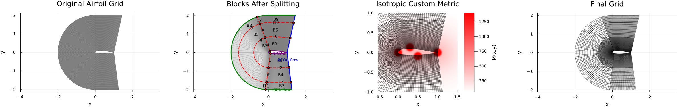
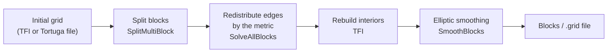
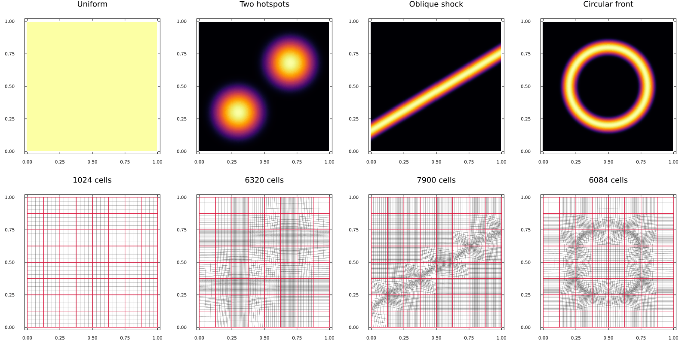
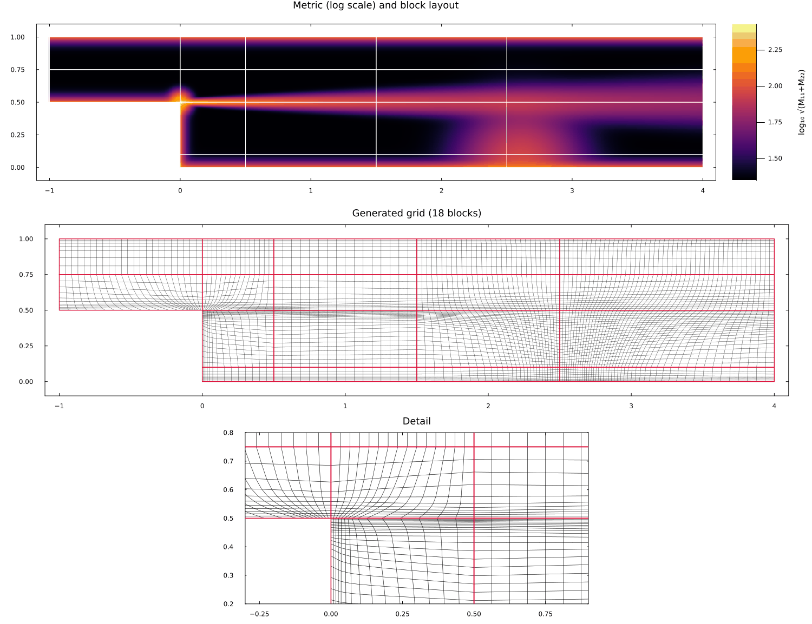

<div align="center">

# GridGeneration.jl

**Metric-driven structured multi-block grid generation in Julia**

[](https://marvyn.com/GridGeneration.jl/stable/)
[](https://marvyn.com/GridGeneration.jl/dev/)
[](https://github.com/MarvynBailly/GridGeneration.jl/actions/workflows/CI.yml)
[](https://julialang.org)
[](LICENSE)



</div>

GridGeneration.jl takes an initial structured grid and a **metric field** describing the
spacing you want, then produces a smooth multi-block grid that follows it. Point counts
are chosen automatically, block interfaces stay point-matched, and grids can be read from
and written to the Tortuga (`.grid`) format.

## Features

- **Metric-adaptive point distribution.** Each block edge is redistributed so the spacing
  equidistributes the metric. The equidistribution ODE is solved semi-analytically
  (`:analytic`) or numerically (`:numeric`), and the optimal number of points per direction
  is computed for you.
- **Block splitting.** Split single or multi-block grids at chosen indices. Splits propagate
  across interfaces automatically, so neighbouring blocks stay point-matched.
- **Transfinite interpolation.** Each block's interior is rebuilt from its redistributed edges with `TFI`.
- **Elliptic smoothing.** A Winslow-type elliptic smoother with wall forcing for orthogonality
  and spacing control. It offers point SOR or line Gauss–Seidel (`sweep = :line`).
- **Tortuga I/O.** Load grids and metric fields, regenerate them, and write `.grid` files.
  Interfaces that only cover part of an edge are aligned automatically.
- **Grid quality.** `ComputeAngleDeviation` measures orthogonality cell by cell.

## Installation

```julia
using Pkg
Pkg.add("GridGeneration")
```

## Quick start

```julia
using GridGeneration

# initial 4×2 rectangle from its four edges: [top, right, bottom, left]
N = 41
top    = [range(0, 4, length=N) fill(2.0, N)]
right  = [fill(4.0, N) range(0, 2, length=N)]
bottom = [range(0, 4, length=N) zeros(N)]
left   = [zeros(N) range(0, 2, length=N)]
initialGrid = TFI([top, right, bottom, left])          # [2, Ni, Nj] array

# metric M(x, y) -> (M11, M22): spacing ≈ 0.1 everywhere, refined near (1, 0)
M = make_getMetric(nothing; A_origin = 2000.0, ℓ_origin = 0.3, p_origin = 2,
                   origin_center = (1.0, 0.0), floor = 100.0)

# split into 4 blocks, redistribute the edges, smooth
params = SimParams(splitLocations = [[11], [11]])
result = GenerateGrid(initialGrid, Any[], Any[], M; params = params)

result.smoothBlocks      # final blocks, each a [2, Ni, Nj] array
```

Regenerating an existing Tortuga grid against its metric field:

```julia
# metricGridFile = the grid the metric was computed on (defaults to the one named in the field file)
blocks, bndInfo, interInfo, M = setup_turtle_grid_domain("field.metric", "input.grid";
                                                         metricGridFile = "metric_grid.grid")
result = GenerateGrid(blocks, bndInfo, interInfo, M; splitRequests = [(1, [[20], [30]])])

mesh3D, bnd3D, itf3D = convert_2D_to_3D(result.smoothBlocks, result.bndInfo, result.interInfo, 0.1, 20)
write_turtle_grid(mesh3D, itf3D, bnd3D, "output.grid")
```

See [Getting Started](docs/src/pages/GettingStarted.md) for the grid, metric and connectivity
conventions.

## How it works



1. **Split.** Blocks are split at the requested indices. Each split line is carried across
   interfaces into neighbouring blocks.
2. **Redistribute.** Each edge is mapped to 1D arc length and the metric is projected onto it.
   The equidistribution ODE `x'' + M'(x)/(2M) x'^2 = 0` gives the point locations, and
   `σ_opt = √(∫p ds / ∫p² ds)` gives the number of points. Opposite edges and neighbouring
   blocks share point counts.
3. **Rebuild.** Interiors are recomputed by transfinite interpolation from the new edges.
4. **Smooth.** An elliptic solve improves smoothness. Optional wall forcing enforces
   orthogonality and a target first-cell spacing.

The [documentation](https://marvyn.com/GridGeneration.jl/stable/) covers the derivation,
the numerical methods and the elliptic smoothing theory.

## Metric-adaptive refinement

Sweeping a metric hotspot along an airfoil: points cluster wherever the metric is large.

<p align="center">
  
</p>

## Gallery

The same block layout adapted to four different metrics: uniform, two hotspots, an oblique
shock, and a circular front.



A backward-facing step given as three blocks. Splits requested on two blocks propagate across
the interfaces, and the metric resolves the walls, the step corner, the shear layer and the
reattachment region.



More cases (a bump channel with anisotropic wall layers, an annulus, a wavy channel, and a
comparison of smoothing options) are in the
[example gallery](https://marvyn.com/GridGeneration.jl/dev/pages/Examples/gallery/), produced by
[`examples/gallery/`](examples/gallery).

## Examples and GUI

| | |
|---|---|
| [`examples/gallery/`](examples/gallery) | Gallery of domains and metrics; `run_gallery.jl` regenerates every figure |
| [`examples/generalExample.jl`](examples/generalExample.jl) | Full airfoil pipeline (C-grid, splitting, metric, smoothing) with before/after plots |
| [`examples/generalExample_blank.jl`](examples/generalExample_blank.jl) | Template for regenerating a Tortuga grid from its metric field |
| [`examples/plotting/`](examples/plotting) | Plots.jl helpers for grids, connectivity, metric fields and angle deviation |
| [`gui/`](gui/README.md) | Interactive GLMakie GUI for splitting, solving and smoothing |

```bash
julia --project=examples -e 'using Pkg; Pkg.develop(path="."); Pkg.instantiate()'   # once
julia --project=examples examples/generalExample.jl
```

## Development

```bash
julia --project=. -e 'using Pkg; Pkg.test()'                                      # tests, incl. Aqua checks
julia --project=docs -e 'using Pkg; Pkg.develop(path="."); Pkg.instantiate()'     # once
julia --project=docs docs/make.jl                                                 # build the docs
```

The theory notes behind the elliptic smoother live in [`math_notes/`](math_notes) and are
published in the documentation.

## Acknowledgements

Developed by Marvyn Bailly under the supervision of [Dr. Larsson](https://larsson.umd.edu)
at the University of Maryland. Released under the [MIT License](LICENSE).
