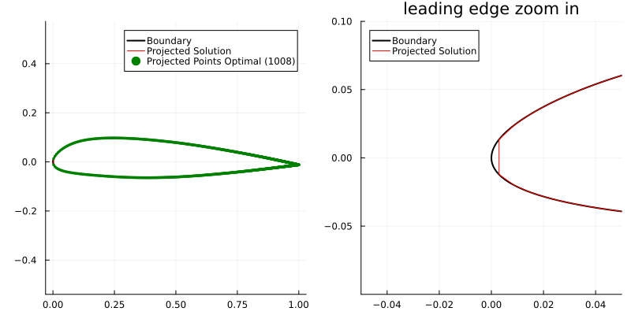

# Mapping the 2 Dimensional Problem to 1 Dimension

Since we aim to construct grid in $\Omega \subset \R^2$, we need a method to convert the 2D problem into a 1D problem. While we have the 1D equation

$\begin{align*}
-8 \sigma^4 M^2 x_s^2  x_{ss} - 4 \sigma^4 M M_x x_s^4  -  4  \sigma^2 m M x_{ss}  -  2 \sigma^2 m M_x x_s^2  = 0,
\end{align*}$

we need to reduce the dimension of $x \in \R^2$ and $M \in \R^{2 \times 2}$. This will consistent of four steps:
- [Convert the 2D metric to 1D](../2Dto1D/MetricReformulation.md)
- [Convert the 2D curve to 1D](../2Dto1D/PointProjection.md)
- [Numerically solve the Spacing ODE](../NumericalMethods/SemiAnalyticalMethod.md)
- [Convert 1D distribution of points back to curve](../2Dto1D/PointProjection.md)

## Results
Putting everything together and using the analytical solver, we get the following results:

### Uniform.

### Clustering at $x=0.0$

Example with sparse sampling of the airfoil:

### Clustering at $x=1$

Zooming in on the leading edge of the airfoil, we see a potential issue: the solution boundary is no longer aligned with the real boundary:

### Real Metric Data

Here we have real metric data:

Since the spacing of the points is hard to see, the difference of the 1D points is plotted in red. 

Here we show real metric data but scaled down by $0.001$:

