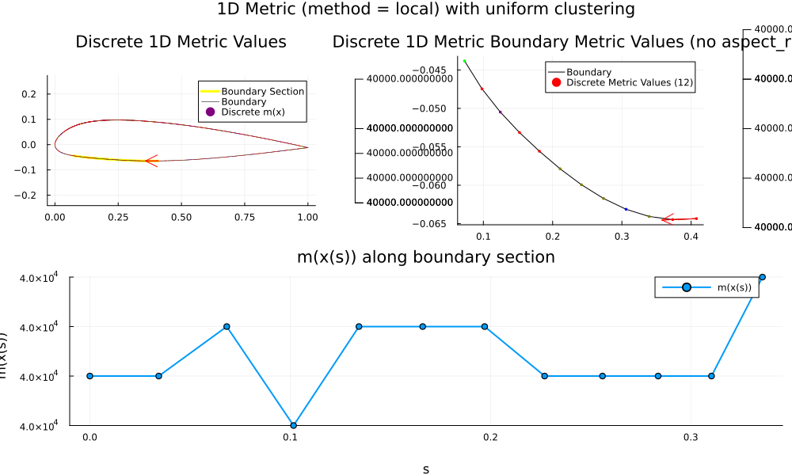
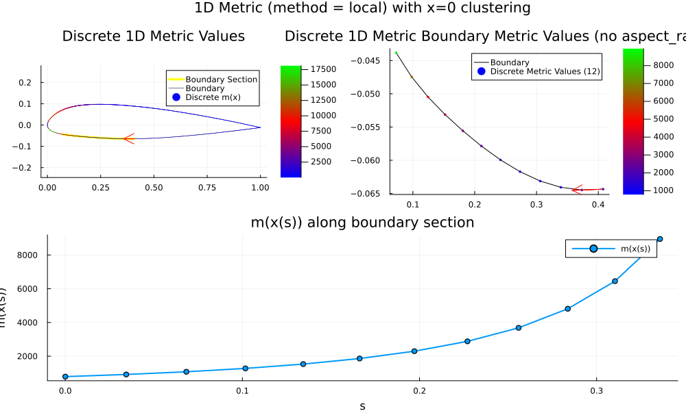
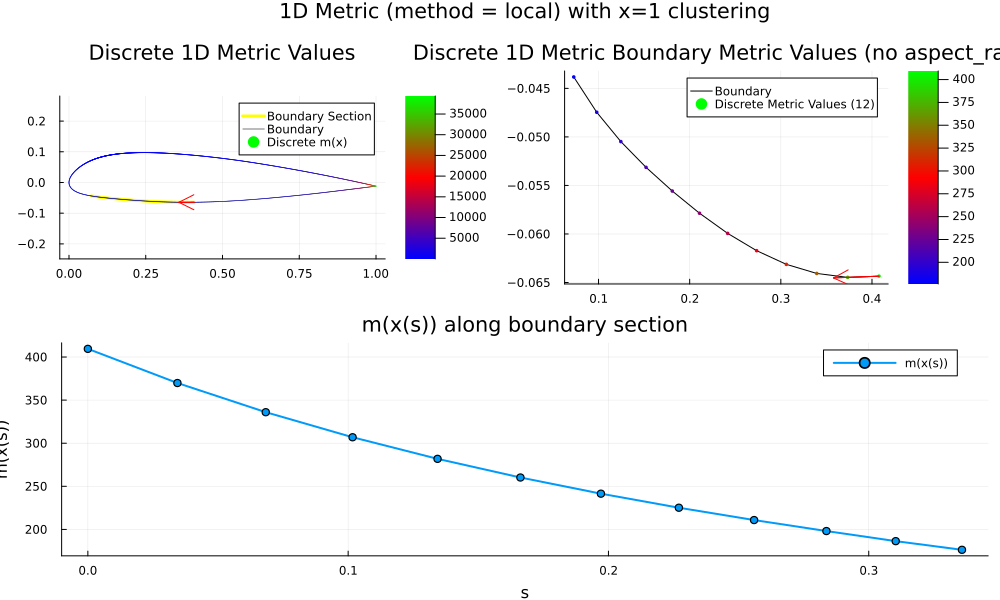

# Metric Reformulation

## 2D to 1D Mapping

### Local Mapping

Suppose we wish to solve the grid spacing along a discrete boundary $\Gamma$ given by the points $\gamma_i \in \R^2$ for $i=1,2,\dots, n$ where $n$ is the total number of points along the boundary. In-between each point is a linear interpolation $\Gamma_i$ for $i=1,2,\dots,n-1$ which defines the piecewise-continuous boundary. 

To find the grid spacing according to the 2D metric tensor $M$, let's compute a new $m$ value to represent the desired metric stretching in $\R$ rather than $\R^2$. Let's define $m_i$ as

$m_i := \frac{1}{|\gamma_{i+1} - \gamma_{i-1}|^2}(\gamma_{i+1} - \gamma_{i-1})^\top \cdot  \begin{pmatrix} M_{11} & M_{12} \\ M_{21} & M_{22} \end{pmatrix}_i \cdot (\gamma_{i+1} - \gamma_{i-1}), \quad i=2,\cdots, n - 1,$

and one sided differences for the edges

$m_1 := \frac{1}{|\gamma_{2} - \gamma_{1}|^2}(\gamma_{2} - \gamma_{1})^\top  \cdot \begin{pmatrix} M_{11} & M_{12} \\ M_{21} & M_{22} \end{pmatrix}_1 \cdot (\gamma_{2} - \gamma_{1}),$

$m_n := \frac{1}{|\gamma_{n} - \gamma_{n-1}|^2}(\gamma_{n} - \gamma_{n-1})^\top \cdot \begin{pmatrix} M_{11} & M_{12} \\ M_{21} & M_{22} \end{pmatrix}_n \cdot (\gamma_{n} - \gamma_{n-1}).$

This is basically a local normalized product between a central difference on $x_i$ and the local $M_i$ tensor. Let's call this method "local."

### Note
- Using the nuclear norm might by bad because it would change the metric value.

### Algorithm

We can compute the metric value $m_i$ using the following 

```julia
function Get1DMetric(points, getMetric; method = "local")
    function norm(v)
        return sqrt(v[1]^2 + v[2]^2)
    end

    n = size(points, 2)
    m = zeros(Float64, n)
    diff = zeros(Float64, 2, n)

    diff[:, 2:n-1] = (points[:, 3:n] - points[:, 1:n-2])     
    diff[:, n] = (points[:, n] - points[:, n-1]) 
    diff[:,1] = points[:, 2] - points[:, 1] 
    
    for i in 1:n
        # get metric value for the points M
        M = getMetric(points[1, i], points[2, i])

        localDiff = diff[:, i]
        normLocalDiff = norm(localDiff)
        m[i] = localDiff' * M * localDiff / normLocalDiff^2
        end
    end

    return m
end
```


## Results
We look at three metric cases:
- Uniform.
- Clustering at $x=0.0$
- Clustering at $x=1$

Let's refer to the real metric tensor as $M(x(s))$ and the computed 1D metric tensor as $m(x(s))$.

Extracted Boundary $\Gamma$ with discrete boundary points $\gamma_i$, linear interpolates $\Gamma_i$, and computed 1D metric values along it are shown in the following plot. Note that the direction of parametrization $s$ is shown by the red arrow.





