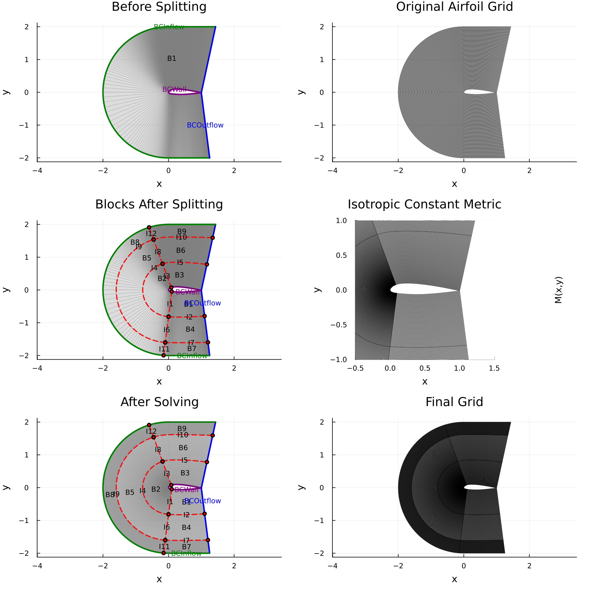
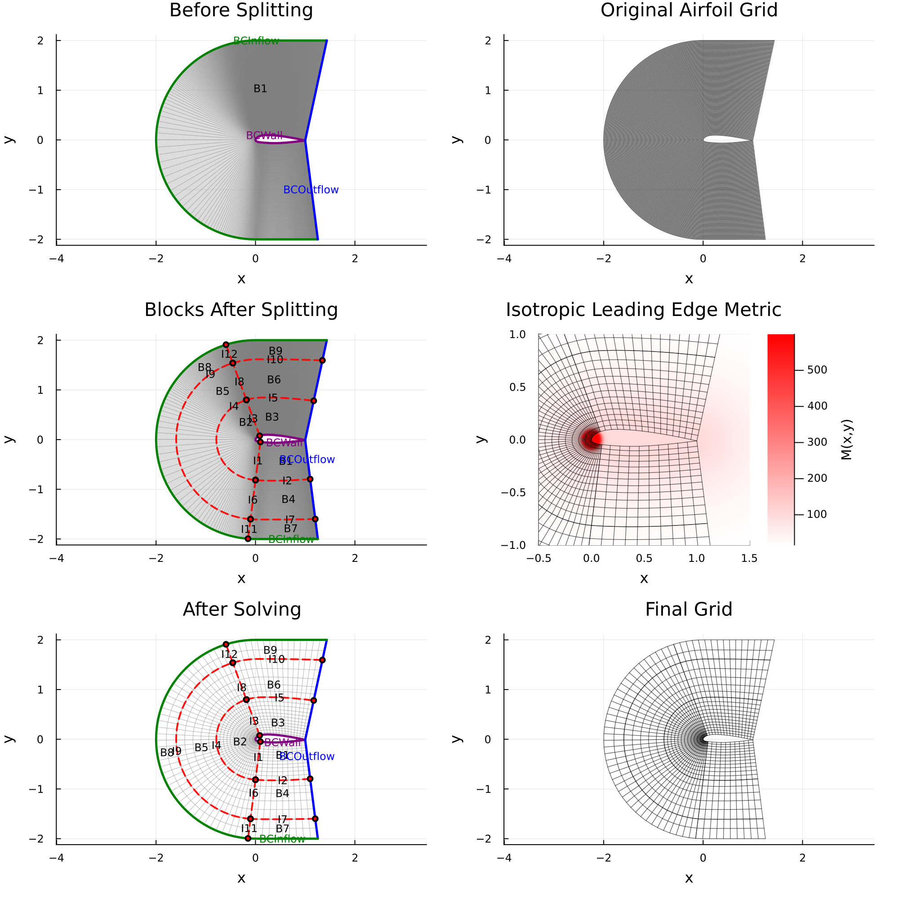
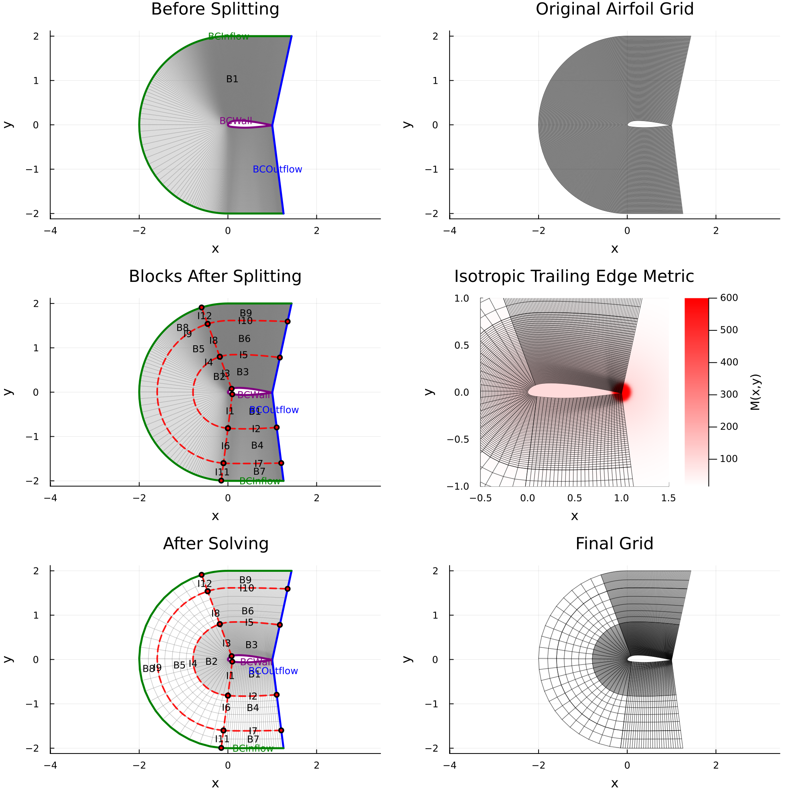
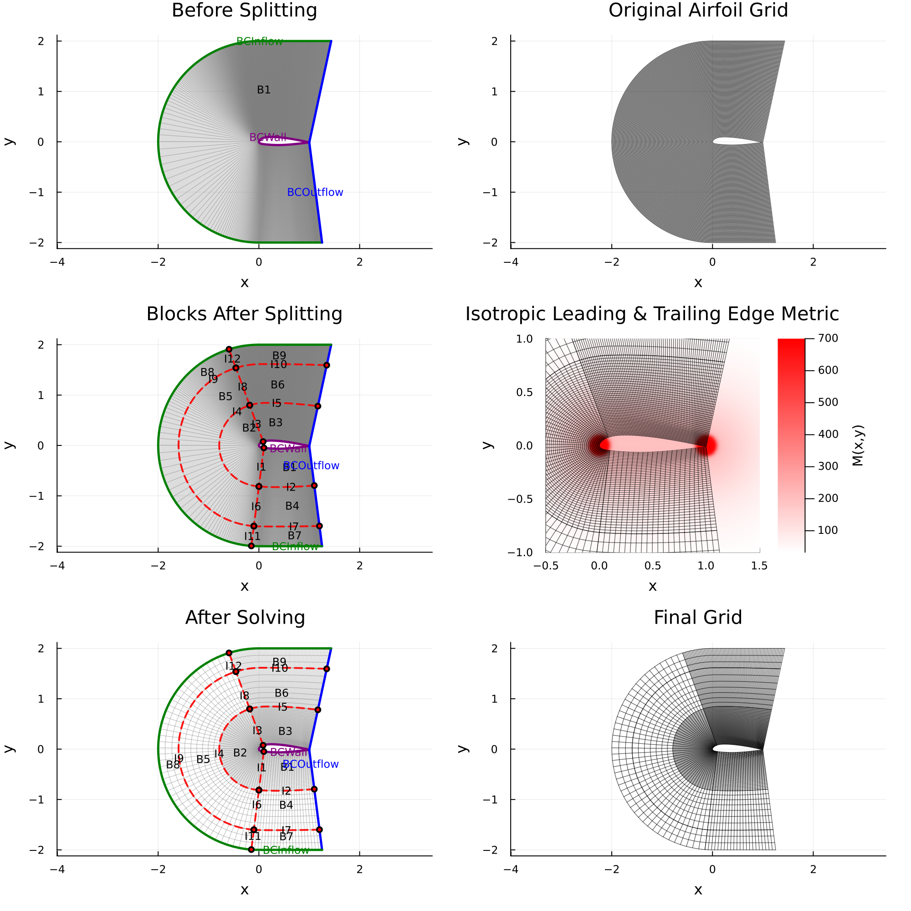
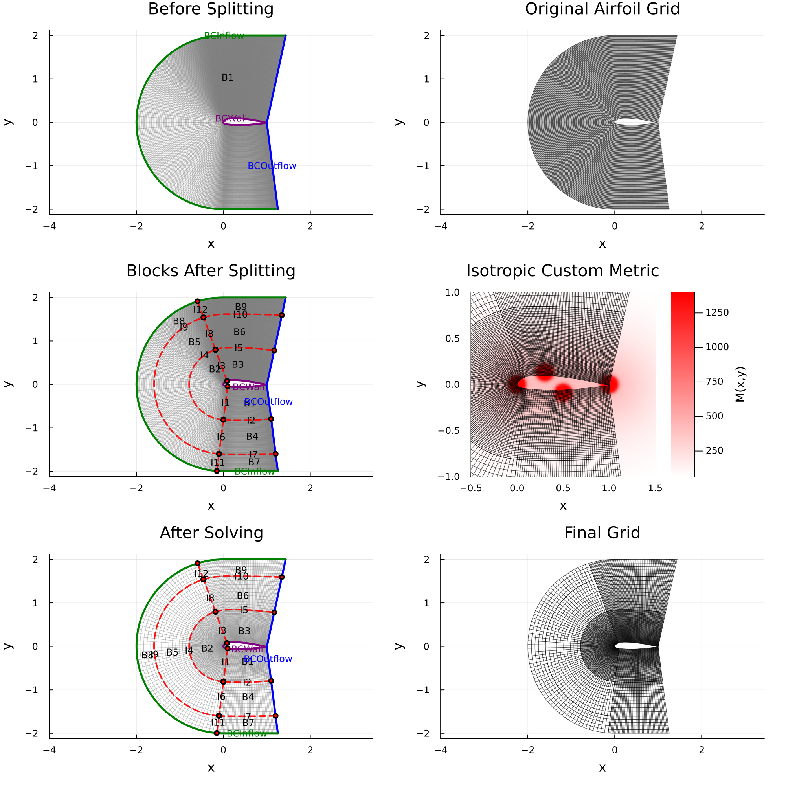

# Airfoil Examples

These figures come from `examples/generalExample.jl` with `case = :airfoil`. The example builds a
C-grid around the A-airfoil, splits it into blocks, redistributes the block edges according to a
metric, and smooths the result. Each panel shows the input grid, the blocks after splitting, the
metric, the blocks after the edge solve, and the final grid.

The metric choices are `GetAirfoilMetric(problem)` in `examples/airfoil/metric/GetMetric.jl`:

```julia
initialGrid, bndInfo, interInfo = GetAirfoilSetup(radius = 3, type = :cgrid)
M = GetAirfoilMetric(problem; scale = 4000)   # problem = 1, ..., 6
params = SimParams(splitLocations = [[300, 400], [30]], boundarySolver = :analytic,
                   smoothMethod = :ellipticSS)
result = GenerateGrid(initialGrid, bndInfo, interInfo, M; params = params)
```

See `examples/README.md` for how to set up and run the example.

## Uniform (problem 1)


## Leading Edge (problem 2)


## Trailing Edge (problem 3)


## Leading and Trailing Edge (problem 4)


## Custom Metric (problem 5)

