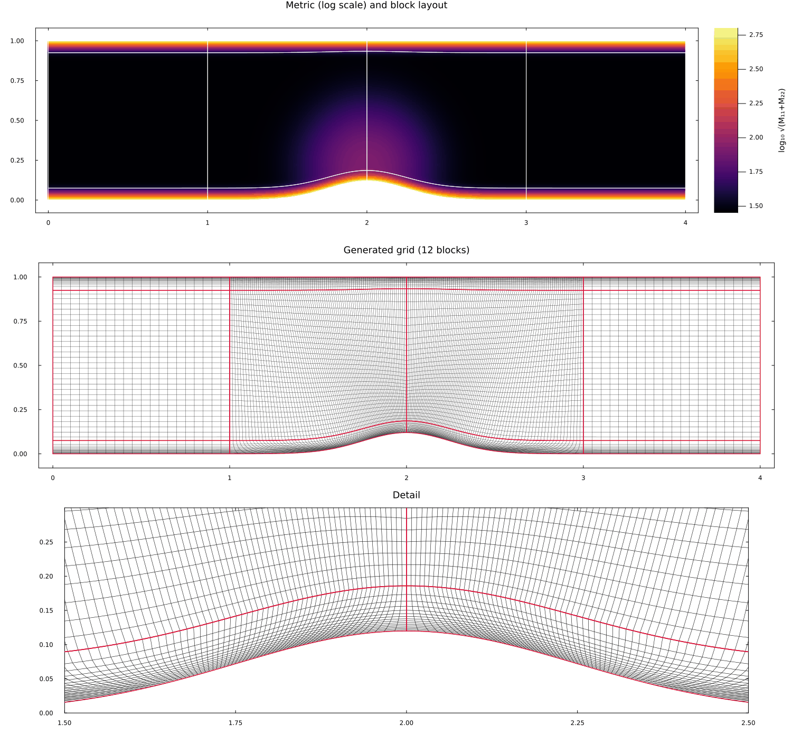
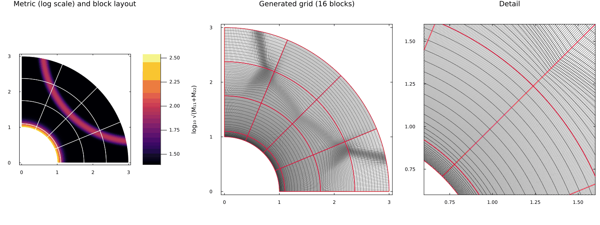
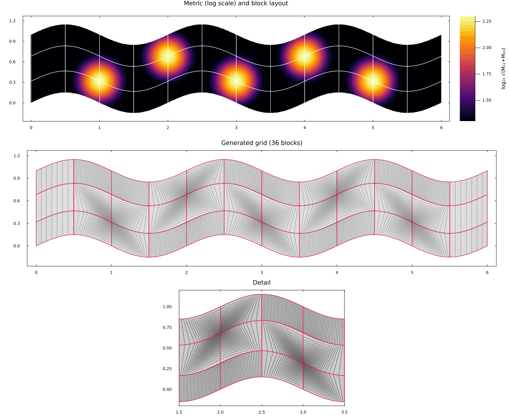
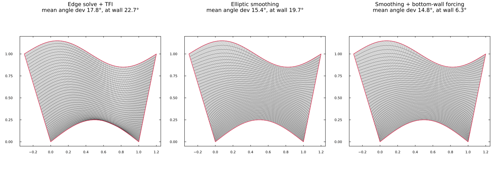

# Example Gallery

These examples show GridGeneration.jl on a range of domains and metrics. Every figure is
produced by the scripts in `examples/gallery/`:

```bash
julia --project=examples -e 'using Pkg; Pkg.develop(path="."); Pkg.instantiate()'   # once
julia --project=examples examples/gallery/run_gallery.jl
```

Each case builds an initial grid from its boundary curves, defines a metric
`M(x, y) -> (M11, M22)`, and runs [`GenerateGrid`](@ref). The figures show the metric
(log scale, with the block layout in white), the generated grid with block boundaries in red,
and a close-up.

## How to read the examples

- **The metric sets the local spacing.** A constant metric `m` asks for spacing `1/√m`. Larger
  values ask for finer cells, and `M11` and `M22` can differ to refine in one direction only.
  The metrics here are built from a few reusable pieces in `examples/gallery/gallery_tools.jl`:
  `background`, `hotspot`, `wall_layer`, `feature_line` and `front`.
- **The metric reaches the grid through the block edges.** Each block edge is redistributed to
  equidistribute the metric, and the interior is filled by transfinite interpolation. Splits are
  therefore placed so that block edges pass through the features to be resolved.
- **The initial grid only describes the geometry.** The metric is sampled at its points and
  the generated grid picks its own resolution, so a fine initial grid is cheap and helps.
- **Smoothing is optional.** Elliptic smoothing improves smoothness and orthogonality but evens
  out interior clustering, so most examples show the grid straight from the edge solve and TFI.
  The last example compares the options.

| Case | Blocks | Cells | Mean / max angle deviation | Time |
|---|---|---|---|---|
| Bump channel | 12 | 12508 | 13.3° / 81.7° | 0.54 s |
| Quarter annulus | 16 | 23424 | 6.5° / 32.5° | 0.12 s |
| Wavy channel | 36 | 26892 | 21.1° / 49.8° | 0.14 s |
| Backward-facing step | 18 | 5680 | 12.4° / 72.0° | 0.35 s |
| Square: uniform | 64 | 1024 | 0.0° / 0.0° | 0.15 s |
| Square: two hotspots | 64 | 6320 | 1.5° / 14.4° | 0.25 s |
| Square: oblique shock | 64 | 7900 | 6.9° / 65.1° | 0.10 s |
| Square: circular front | 64 | 6084 | 12.5° / 57.7° | 0.10 s |

Angle deviation is the departure of grid lines from orthogonality per cell, from
[`ComputeAngleDeviation`](@ref). Times are for `GenerateGrid` on a laptop.

## Channel with a bump: anisotropic wall layers

A channel whose lower wall has a Gaussian bump. The wall layers are **anisotropic**: they only
increase `M22`, so cells shrink across the walls but not along them. A hotspot adds refinement in
the flow over the bump. Thin blocks along both walls hold the layers.



!!! details "Code: examples/gallery/cases/bump_channel.jl"
    ```julia
    # Channel with a Gaussian bump on the lower wall.
    # Anisotropic wall layers (only M22) cluster cells across both walls without
    # over-refining along them; a hotspot refines the flow over the bump crest.

    bump(x) = 0.12 * exp(-((x - 2.0) / 0.35)^2)

    function bump_channel_case()
        L, H = 4.0, 1.0
        # The initial grid only describes the geometry and where the metric is sampled,
        # so make it fine (the generated grid chooses its own resolution).
        initial = block_from_curves(
            t -> (L * t, bump(L * t)),      # bottom wall with the bump
            t -> (L * t, H),                # top wall
            line((0.0, 0.0), (0.0, H)),     # inlet
            line((L, 0.0), (L, H));         # outlet
            Ni = 321, Nj = 201)

        # distance to the nearest wall (vertical distance is accurate enough for a gentle bump)
        wall_dist(x, y) = min(y - bump(x), H - y)

        M = metric_sum(
            background(400.0),                                    # spacing ≈ 0.05 away from walls
            wall_layer(wall_dist, 400_000.0, 0.012; normal = :y), # wall-normal clustering only
            hotspot((2.0, 0.22), 3_000.0, 0.3),                   # refine over the bump
        )

        params = SimParams(
            splitLocations = [[81, 161, 241], [16, 186]],   # thin wall blocks hold the layers
            boundarySolver = :analytic,
            useSmoothing = false,      # keep the metric-driven clustering from the edge solve + TFI
        )
        return (; input = initial, bndInfo = Any[], interInfo = Any[], M, params,
                  zoom = ((1.5, 2.5), (0.0, 0.3)))
    end
    ```

## Quarter annulus: a wall layer and a curved front

A quarter annulus with an isotropic layer on the inner wall and a circular front that cuts
diagonally across the block layout. The front is picked up wherever it crosses a block edge.



!!! details "Code: examples/gallery/cases/annulus.jl"
    ```julia
    # Quarter annulus 1 ≤ r ≤ 3: an isotropic layer on the inner wall plus a circular
    # "front" that cuts diagonally across the blocks.

    function annulus_case()
        arc(R) = t -> (R * cos(π / 2 * (1 - t)), R * sin(π / 2 * (1 - t)))   # from (0, R) to (R, 0)
        initial = block_from_curves(
            arc(1.0),                        # inner wall
            arc(3.0),                        # outer boundary
            line((0.0, 1.0), (0.0, 3.0)),
            line((1.0, 0.0), (3.0, 0.0));
            Ni = 241, Nj = 161)

        M = metric_sum(
            background(300.0),
            wall_layer((x, y) -> hypot(x, y) - 1.0, 60_000.0, 0.04),   # inner-wall layer
            front((3.2, 3.2), 2.6, 4_000.0, 0.08),                     # curved front
        )

        params = SimParams(splitLocations = [[61, 121, 181], [9, 61, 111]], useSmoothing = false)
        return (; input = initial, bndInfo = Any[], interInfo = Any[], M, params,
                  zoom = ((0.6, 1.6), (0.6, 1.6)))
    end
    ```

## Wavy channel: a vortex street

A channel with wavy walls and a staggered row of hotspots, like the cores of a vortex street.
Split lines pass through every core, so the block corners sit on the features and the clustered
edges radiate from them.



!!! details "Code: examples/gallery/cases/wavy_channel.jl"
    ```julia
    # Wavy channel with a staggered row of hotspots, like the cores of a vortex street.
    # The metric reaches the grid through the block edges, so the split lines are placed
    # through the cores.

    wave(x) = 0.15 * sin(2π * x / 2)

    function wavy_channel_case()
        L = 6.0
        initial = block_from_curves(
            t -> (L * t, wave(L * t)),
            t -> (L * t, 1.0 + wave(L * t)),
            line((0.0, 0.0), (0.0, 1.0)),
            line((L, wave(L)), (L, 1.0 + wave(L)));
            Ni = 361, Nj = 121)

        # cores at x = 1, ..., 5, alternating above and below the centreline
        cores = [(1.0 + k, 0.5 + (isodd(k) ? 0.18 : -0.18)) for k in 0:4]
        M = metric_sum(background(200.0), (hotspot(c, 20_000.0, 0.16) for c in cores)...)

        # i-splits at every core (x = 1..5) and half-way between; j-splits through both rows of cores
        params = SimParams(splitLocations = [collect(31:30:331), [39, 83]], useSmoothing = false)
        return (; input = initial, bndInfo = Any[], interInfo = Any[], M, params,
                  zoom = ((1.5, 3.5), (-0.2, 1.2)))
    end
    ```

## Backward-facing step: multi-block input with split propagation

A genuine three-block input: the inlet channel, the region above the step height, and the region
behind the step, connected by two interfaces. Splits are requested on two blocks only, and
[`SplitMultiBlock`](@ref) carries them across the interfaces. The `x`-splits of the upper block
continue into the lower block, and its `y`-split continues into the inlet.

The metric resolves the walls (anisotropically, across each wall only), the step corner, a shear
layer that leaves the corner along the block interface and spreads downstream, and the
reattachment region on the floor.


!!! details "Code: examples/gallery/cases/backward_step.jl"
    ```julia
    # Backward-facing step as a genuine multi-block input (3 blocks with interfaces).
    # Splits requested on two blocks propagate across the interfaces; the metric refines
    # the shear layer leaving the step corner, the corner itself, and the walls.

    function backward_step_case()
        h = 0.5
        rect(x0, x1, y0, y1, ni, nj) = block_from_curves(
            line((x0, y0), (x1, y0)), line((x0, y1), (x1, y1)),
            line((x0, y0), (x0, y1)), line((x1, y0), (x1, y1)); Ni = ni, Nj = nj)
        inlet = rect(-1.0, 0.0, h, 1.0, 41, 41)     # block 1: channel upstream of the step
        upper = rect(0.0, 4.0, h, 1.0, 161, 41)     # block 2: downstream, above the step height
        lower = rect(0.0, 4.0, 0.0, h, 161, 41)     # block 3: downstream, below (behind the step)
        blocks = [inlet, upper, lower]

        face(b, s, e) = Dict{String,Any}("block" => b, "start" => s, "end" => e)
        interInfo = Any[
            Dict{String,Any}("blockA" => 1, "blockB" => 2, "start_blkA" => [41, 1], "end_blkA" => [41, 41],
                             "start_blkB" => [1, 1], "end_blkB" => [1, 41], "offset" => [0.0, 0.0, 0.0], "angle" => 0.0),
            Dict{String,Any}("blockA" => 2, "blockB" => 3, "start_blkA" => [1, 1], "end_blkA" => [161, 1],
                             "start_blkB" => [1, 41], "end_blkB" => [161, 41], "offset" => [0.0, 0.0, 0.0], "angle" => 0.0),
        ]
        bndInfo = Any[
            Dict{String,Any}("name" => "inflow",  "faces" => Any[face(1, [1, 1], [1, 41])]),
            Dict{String,Any}("name" => "outflow", "faces" => Any[face(2, [161, 1], [161, 41]), face(3, [161, 1], [161, 41])]),
            Dict{String,Any}("name" => "wall",    "faces" => Any[face(1, [1, 1], [41, 1]), face(1, [1, 41], [41, 41]),
                                                                 face(2, [1, 41], [161, 41]), face(3, [1, 1], [161, 1]),
                                                                 face(3, [1, 1], [1, 41])]),
        ]

        # distances to the horizontal walls (top, upstream floor at y = h, downstream floor at 0)
        # and to the vertical step face (x = 0, y < h)
        floor_dist(x, y) = min(1.0 - y, x < 0 ? y - h : y)
        face_dist(x, y) = (x >= 0 && y < h) ? x : Inf

        # shear layer leaving the corner along y = h, spreading downstream (only across it: M22)
        shear_layer(x, y) = x <= 0 ? (0.0, 0.0) :
            (0.0, 30_000.0 * exp(-((y - h) / (0.015 + 0.03x))^2) / (1 + 2x))

        M = metric_sum(
            background(250.0),
            wall_layer(floor_dist, 15_000.0, 0.02; normal = :y),   # across the horizontal walls only
            wall_layer(face_dist, 15_000.0, 0.02; normal = :x),    # across the step face only
            shear_layer,
            hotspot((0.0, h), 15_000.0, 0.06),                      # step corner
            hotspot((2.6, 0.0), 4_000.0, 0.35),                     # reattachment region
        )

        # split block 2 in i (propagates into block 3) and in j (propagates into block 1),
        # and block 3 near its floor
        splitRequests = [(2, [[21, 61, 101], [21]]), (3, [Int[], [9]])]
        params = SimParams(useSmoothing = false)
        return (; input = blocks, bndInfo, interInfo, M, params, splitRequests,
                  zoom = ((-0.3, 0.9), (0.2, 0.8)))
    end
    ```

## One layout, four metrics

The unit square split into 8×8 blocks and adapted to four different metrics. Clustering on the
block edges is joined across each block by TFI, so the oblique shock and the circular front are
followed through the layout even though they cut the blocks diagonally. Because point counts are
shared along each row and column of blocks, refinement for a hotspot extends across the whole
row and column.


!!! details "Code: examples/gallery/cases/square_metrics.jl"
    ```julia
    # One domain, one block layout, four metrics: the unit square split into 8×8 blocks,
    # adapted to a uniform metric, two hotspots, an oblique "shock" and a circular front.
    # Clustering on the block edges is joined across each block by TFI, so straight
    # features crossing a block are followed even when they cut it diagonally.

    function square_metrics_cases()
        square = block_from_curves(line((0, 0), (1, 0)), line((0, 1), (1, 1)),
                                   line((0, 0), (0, 1)), line((1, 0), (1, 1)); Ni = 161, Nj = 161)
        params = SimParams(splitLocations = [collect(21:20:141), collect(21:20:141)], useSmoothing = false)
        metrics = [
            "Uniform"        => background(900.0),
            "Two hotspots"   => metric_sum(background(400.0), hotspot((0.3, 0.3), 30_000.0, 0.1),
                                           hotspot((0.7, 0.68), 30_000.0, 0.1)),
            "Oblique shock"  => metric_sum(background(400.0), feature_line((0.5, 0.46), (1.0, 0.6), 25_000.0, 0.03)),
            "Circular front" => metric_sum(background(400.0), front((0.5, 0.5), 0.3, 25_000.0, 0.03)),
        ]
        return square, params, metrics
    end

    function square_metrics_figure(path)
        square, params, metrics = square_metrics_cases()
        kw = (aspect_ratio = :equal, framestyle = :box, grid = false, legend = false,
              xlims = (-0.02, 1.02), ylims = (-0.02, 1.02), titlefontsize = 12, tickfontsize = 7)
        tops = Any[]; bottoms = Any[]; stats = []
        for (name, M) in metrics
            result, s = run_case(square, Any[], Any[], M; params)
            push!(stats, name => s)
            p = plot(; title = name, kw...)
            draw_metric!(p, result.smoothBlocks, M; npix = 300)
            plot!(p; colorbar = false)
            push!(tops, p)
            q = plot(; title = "$(s.cells) cells", kw...)
            draw_blocks!(q, result.smoothBlocks; lw = 0.3, outline_lw = 1.0)
            push!(bottoms, q)
        end
        fig = plot(tops..., bottoms...; layout = (2, 4), size = (1600, 820),
                   left_margin = 2Plots.mm, bottom_margin = 2Plots.mm)
        savefig(fig, path)
        return stats
    end
    ```

## Elliptic smoothing and wall forcing

A distorted domain with a curved lower wall carrying a wall layer, shown three ways:

| Variant | Mean angle deviation | At the curved wall |
|---|---|---|
| Edge solve + TFI | 17.8° | 22.7° |
| Elliptic smoothing (`sweep = :line`) | 15.4° | 19.7° |
| Smoothing + bottom-wall forcing | 14.8° | 6.3° |

TFI keeps the wall clustering but carries the skew of the boundaries into the interior. Elliptic
smoothing evens the grid lines out, and wall forcing additionally makes the grid meet the curved
wall nearly at right angles. Both smoothed grids lose most of the interior clustering, which is
the trade-off to weigh when choosing `useSmoothing`.



!!! details "Code: examples/gallery/cases/smoothing.jl"
    ```julia
    # Elliptic smoothing on a distorted domain with curved, skewed sides.
    # TFI alone carries the skew of the boundaries into the interior; elliptic smoothing
    # straightens and evens out the grid lines, and wall forcing on the curved bottom wall
    # additionally makes the grid meet that wall at right angles.

    function smoothing_cases()
        initial = block_from_curves(
            t -> (t, 0.25 * sin(π * t)),                   # curved bottom wall
            t -> (-0.3 + 1.5t, 1.0 + 0.15 * sin(2π * t)),  # wavy top
            line((0.0, 0.0), (-0.3, 1.0)),                  # skewed left side
            line((1.0, 0.0), (1.2, 1.0));                   # skewed right side
            Ni = 121, Nj = 121)
        M = metric_sum(background(900.0),
                       wall_layer((x, y) -> y - 0.25 * sin(π * clamp(x, 0, 1)), 20_000.0, 0.06))
        base = (; splitLocations = Vector{Vector{Int}}(), useSplitting = false)
        variants = [
            "Edge solve + TFI" => SimParams(; base..., useSmoothing = false),
            "Elliptic smoothing" => SimParams(; base...,
                elliptic = EllipticParams(sweep = :line, ω = 1.3, useBottomWall = false, max_iter = 20_000, tol = 1e-8)),
            "Smoothing + bottom-wall forcing" => SimParams(; base...,
                elliptic = EllipticParams(useBottomWall = true, max_iter = 20_000, tol = 1e-8)),
        ]
        return initial, M, variants
    end

    # angle between the grid line leaving the bottom wall and the wall itself, averaged
    function wall_angle_deviation(b)
        x, y = b[1, :, :], b[2, :, :]
        devs = map(2:size(x, 1)-1) do i
            t = (x[i+1, 1] - x[i-1, 1], y[i+1, 1] - y[i-1, 1])
            n = (x[i, 2] - x[i, 1], y[i, 2] - y[i, 1])
            abs(acosd(clamp((t[1] * n[1] + t[2] * n[2]) / (hypot(t...) * hypot(n...)), -1, 1)) - 90)
        end
        return sum(devs) / length(devs)
    end

    function smoothing_figure(path)
        initial, M, variants = smoothing_cases()
        kw = (aspect_ratio = :equal, framestyle = :box, grid = false, legend = false,
              xlims = (-0.35, 1.25), ylims = (-0.05, 1.2), titlefontsize = 11, tickfontsize = 7)
        panels = Any[]; stats = []
        for (name, params) in variants
            result, s = run_case(initial, Any[], Any[], M; params)
            wall = wall_angle_deviation(result.smoothBlocks[1])
            push!(stats, name => merge(s, (; wall)))
            p = plot(; title = "$name\nmean angle dev $(round(s.meandev, digits=1))°, at wall $(round(wall, digits=1))°", kw...)
            draw_blocks!(p, result.smoothBlocks; lw = 0.4, outline_lw = 1.2)
            push!(panels, p)
        end
        fig = plot(panels...; layout = (1, 3), size = (1500, 560), left_margin = 3Plots.mm, bottom_margin = 3Plots.mm)
        savefig(fig, path)
        return stats
    end
    ```

## More

- The [airfoil examples](./airfoil.md) show a C-grid around an airfoil with several metrics,
  including a metric field loaded from file.
- [Getting Started](../GettingStarted.md) explains the conventions used here.
