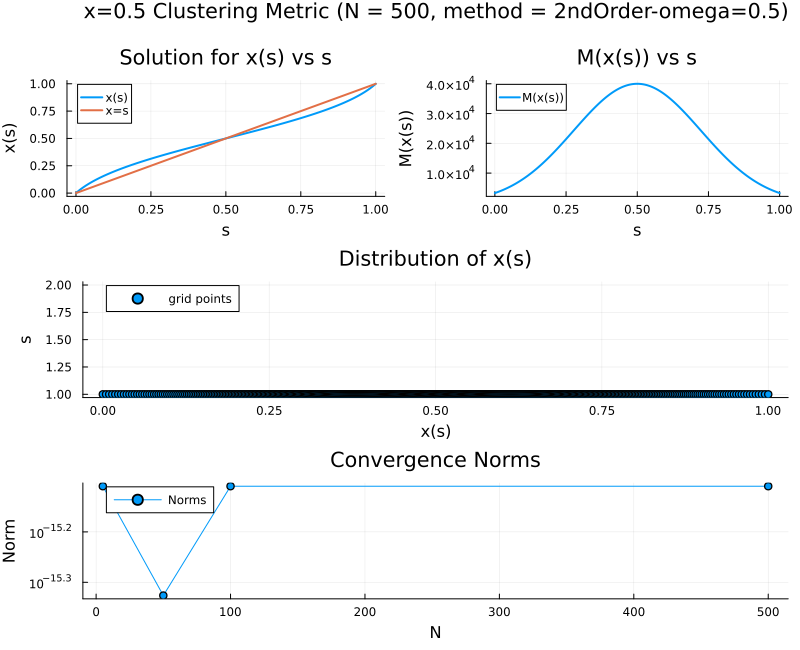
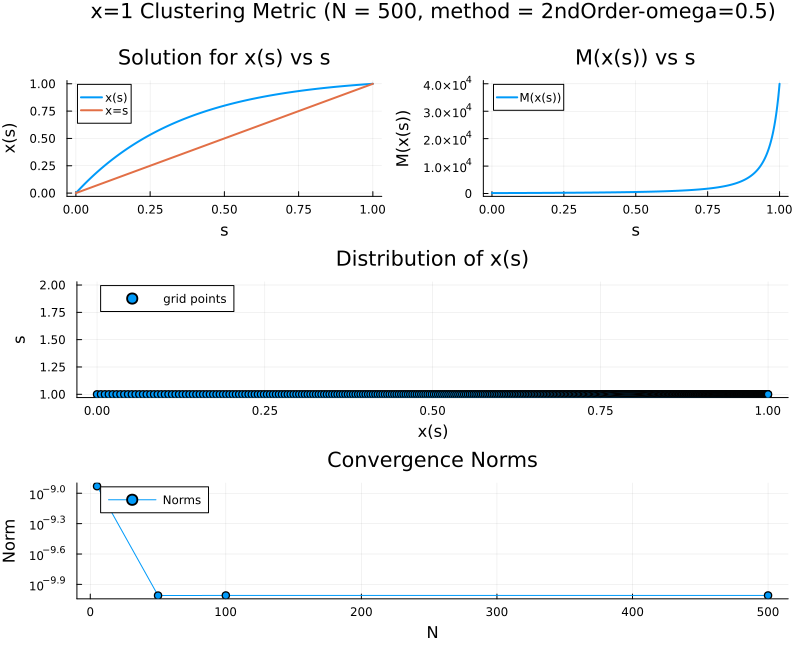

# Second Order Nonlinear ODE Boundary Value Solver
we have the ODE

$x_{ss} + \frac{ M_x x_s^2}{2M} = 0,$

with boundary values $x(0) = a$ and $x(1) = b$ from [math work](../ODE/MathematicalWork.md). Let $f(x) = \frac{M_x}{2 M}$ to get

$x_{ss} + f(x) x_{s}^2 = 0$.
w
## Numerical Method
Let $\{x_i\}_{i=0}^{N+1}$ be a discretization of $[a, b]$ with uniform grid spacing $h$. Let's discretizing $x_{ss}$ and $x_s$ via a second order central difference:

$x_{s} = \frac{x_{i+1} - x_{i-1}}{2h}, \quad x_{ss} = \frac{x_{i-1} - 2x_i + x_{i+1}}{h^2},$ 

where $h = \Delta x$. Plugging this into the ODE yields the ith equation to be

$\frac{1}{h^2} \left(x_{i-1} - 2x_i + x_{i+1}\right) + \frac{f_i}{4 h^2} \left(x_{i+1} - x_{i-1} \right)^2 = 0$.

Now let's use an iterative method to solve for the nonlinearity. Now on the $k+1$th iteration, we treat the nonlinear terms as known from the $k$th iteration to get

$\frac{1}{h^2} \left(x_{i-1}^{(k+1)} - 2x_i^{(k+1)} + x_{i+1}^{(k+1)}\right) = - \frac{f_i^{(k)}}{4 h^2} \left(x_{i+1}^{(k)} - x_{i-1}^{(k)} \right)^2$.

This is a tri-diagonal system which we can solve with [Thomas's algorithm](https://en.wikipedia.org/wiki/Tridiagonal_matrix_algorithm) on each iteration. We can formulate the system as

$\frac{1}{h^2}\begin{pmatrix} 
-2 & 1 &&&0\\
1 & - 2 & 1 &&\\
& \ddots & \ddots & \ddots\\
 &  & 1 & -2 &1\\
0&  &  & 1 & -2\\
\end{pmatrix} \begin{pmatrix} x^{(k+1)}_1 \\ x^{(k+1)}_2 \\ \vdots \\  x^{(k+1)}_{N-1} \\ x^{(k+1)}_{N} \end{pmatrix} = \begin{pmatrix} -\frac{f_1^{(k)}}{4h^2} \left( x_{2}^{(k)} - x_{0} \right)^2 - \frac{x_0}{h^2} \\ -\frac{f_2^{(k)}}{4h^2} \left( x_{3}^{(k)} - x_{1}^{(k)} \right)^2 \\ \vdots \\ -\frac{f_{N-1}^{(k)}}{4h^2} \left( x_{N}^{(k)} - x_{N-2}^{(k)} \right)^2 \\ -\frac{f_N^{(k)}}{4h^2} \left( x_{N+1}^{(k)} - x_{N-1}^{(k)} \right)^2 - \frac{x_{N+1}}{h^2} \end{pmatrix}$

where we can enforce the boundary conditions through $x_0 = a$ and $x_{N+1} = b$. For us, we will have $a=0$ and $b=1$.

## Algorithms
### Thomas Algorithm
A very straightforward guy

```julia
function thomas_algorithm(a, b, c, d)
    n = length(d)
    cp = similar(c)
    dp = similar(d)

    # forward sweep
    cp[1] = c[1] / b[1]
    dp[1] = d[1] / b[1]

    for i in 2:n
        denom = b[i] - a[i] * cp[i-1]
        cp[i] = c[i] / denom
        dp[i] = (d[i] - a[i] * dp[i-1]) / denom
    end

    # backward substitution
    x = zeros(n)
    x[end] = dp[end]
    for i = n-1:-1:1
        x[i] = dp[i] - cp[i] * x[i+1]
    end

    return x
end
```

### Solver

With this in hand, we set up the solver

```julia
function solve_bvp_fixed_point(f, x0, x1; N=100, max_iter=100, tol=1e-8)
    function normInf(x)
        return maximum(abs, x)
    end
    
    h = 1.0 / (N + 1)
    x = range(0, 1, length=N+2)

    u = [x0; collect(x[2:end-1]); x1]  # initial guess: linear

    println(size(u))

    u_new = similar(u)

    # Storage for tridiagonal matrix
    a = fill(1 / h^2, N)    # subdiagonal
    b = fill(-2 / h^2, N)   # diagonal
    c = fill(1 / h^2, N)    # superdiagonal
    rhs = zeros(N)

    for iter in 1:max_iter
        for i in 1:N
            fi = f(u[i+1])

            du = u[i+2] - u[i]
            
            rhs[i] = - (fi / (4h^2)) * du^2
        end
        rhs[1] += - x0 / h^2
        rhs[end] += - x1 / h^2


        # Solve linear system
        δu = thomas_algorithm(a, b, c, rhs)

        # Update interior points
        u_new[1] = x0
        u_new[end] = x1
        u_new[2:N+1] = δu

        # Check convergence
        if normInf(u_new - u) < tol
            println("Converged in $iter iterations")
            return x, u_new
        end

        u .= u_new
    end

    error("Did not converge after $max_iter iterations.")
end
```

Note here that $f$ is expecting a function. We can use our piecewise linear interpolator to take the discrete points given by $M_x(x_i)/(2M(x_i))$ where $M_x$ is approximated through central differences. 

Another note is that if we start struggling to solve this, we can always add relaxation to the updates.

We can define the RHS as 

```
function f(x, scale, problem)
    return (M_u1_func(x,) / (2 * M_func(x,)))
end
```

## Under Relaxation
We run into numerical instability pretty quickly. For example, using 

$M(x) = \frac{\alpha}{(1 + 15x)^2},$

with $alpha = 40000$ and $N \in [5, 50, 100, 500]$. We have the algorithm terminate after $100$ iterations or if the infinity norm of the residual drops below `1e-15`. This gives the following results


We can see the numerical instability in the convergence plot and solution.

Let's use under-relaxation to update `u`:

```julia
#omega is relaxation parameter.
u .= (1 - omega) * u + omega * u_new
```

Note that $\omega = 1$ is equivalent to before. Now running with $\omega = 0.5$ we get the results which look a lot better:


Furthermore, running with $s = 100000$ yields


## Verification
For now, let's go ahead and use this since the solution passes the "eye-norm."
### Order of Convergence
This method should be second order accurate.

### Method of Manufactured Solutions
We could use manufactured solutions.

## Results

Let's compare the distribution of points for four different metrics
- Uniform: $M_1(x) = \alpha.$
- Clustering at $x=0.0$: $M_2(x) =  \frac{\alpha}{(1 + 15x)^2}.$
- Clustering at $x=1$: $M_3(x) =  \frac{\alpha}{(1 + 15(1-x))^2}.$
- Clustering at $x=0.5$: $M_4(x) = \alpha \text{exp}\left( \frac{-(x - 0.5)^2}{\eta}\right).$
- Clustering at the edges: $M_5(x) = M_2(x) + M_3(x).$ 

where $\alpha$ and $\beta$ are parameters.

Here are the results for the numerical approach with $\alpha = 40000$ and $\beta = 0.1$. With the last two examples, we are already running into the solver not being able to handel the stiffness of the problem. We note that convergence plots are not the most telling since in all cases, the norm of the error reduces to machine precision.

### Uniform


### Clustering Near $x=0$



### Clustering Near $x=1$



### Clustering Near $x=0.5$


### Clustering Near Edges 


