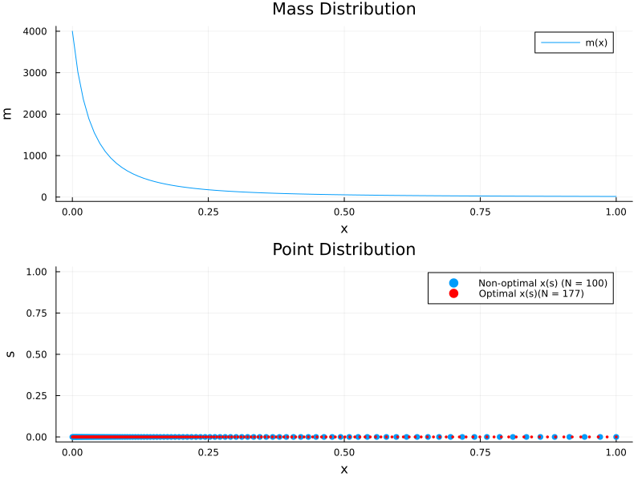
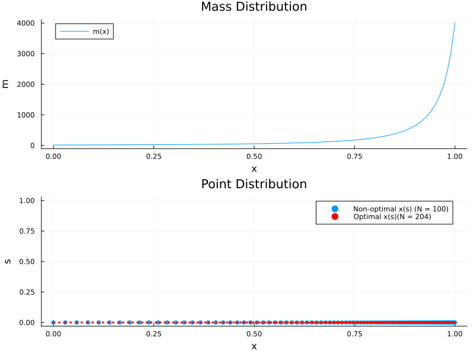
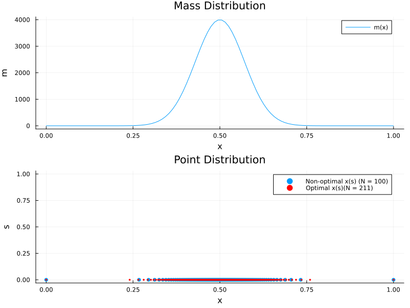
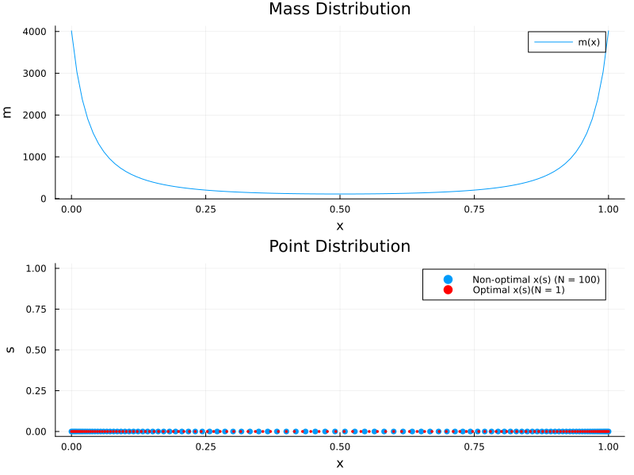
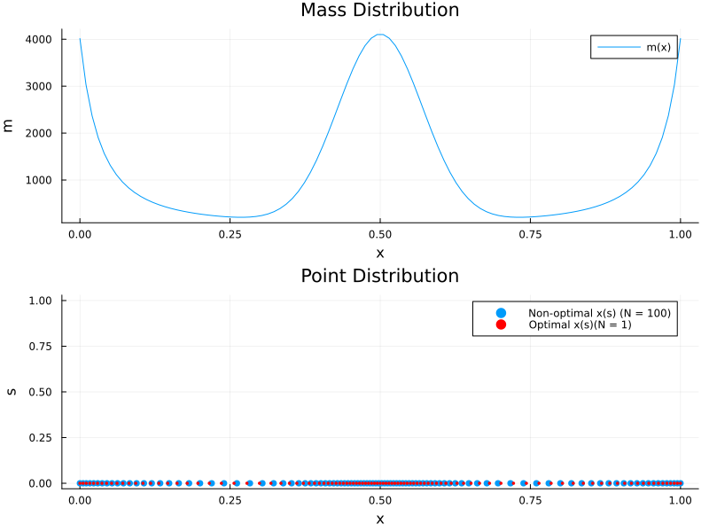

# Semi Analytic Solution

## Set up 

As shown in [math work](../ODE/MathematicalWork.md), we can reduce the ODE to

We have an initial value boundary value problem (IVBP ODE), so let's prescribe boundary conditions at $x(s=0) = 0$ and $x(s=1) = 1$ such that our computational domain is $s \in [0,1]$ and the physical domain is $x \in [0,1] \subset \R$.

$I(x) := \int_{x(0)}^{x(s)} \sqrt{M(\xi)} d\xi = C_1 s$

Finally let's enforce the boundary condition at $x(1) = 1$ to solve for $C_1$ and find that

$C_1 = \int_{0}^{1} \sqrt{M(\xi)} d \xi =: I_\text{tot}.$

Therefore the final solution becomes

$\int_{0}^{x(s)} \sqrt{M(\xi)} d\xi = I_\text{tot} s.$

Now since the form of $M(x(s))$ is "not known" but rather is given as discrete points, integrating must be done numerically. We do know that $M$ is SPD and so 

$l^\top M l \geq 0, \forall l.$

Since we are approximating $M \in \R^{2 \times 2}$ by $m = l^\top M l \in \R$, we are ensured that $\sqrt(m)$ will be positive. This implies that $I(x)$ is monotone increasing (modulo edge cases). To compute $I^{-1}(x)$, let's use linear interpolation. We can later try using "monotone cubic Hermite" (PCHIP).

## Algorithm
Since the real function of $M(x)$ is unknown, let's use trapezoid rule to integrate. Then the algorithm will follow the steps

- Compute $I(x)$ via trapezoid rule.
- Compute $l = I(1)$.
- Solve $I(x) = s * I(1)$
  - Linear Interpolation
  - monotone cubic Hermite (PCHIP)
  - Higher order interpolation


### Linear Interpolation

If we assume that $I(x)$ is given by piecewise linear functions between nodal values, than 

$I(x) \approx I_i + \frac{I_{i+1} - I_{i}}{x_{i+1} - x_i} (x - x_{i+1})$

Since we have our trapezoidal approximation we can write $I(x) \approx t_j$ and solving for $x$ now gives

$\theta = \frac{t_j - I_i}{I_{i+1} - I_i} \in [0,1], \quad x_j = x_i + \theta (x_{i+1} - x_i)$

where we can numerically find $i$ using a binary search which is helpfully defined in Julia as `searchsortedlast(dist, pnt)`.

```julia
function equidistribute_linear_inverse(x, m, N)
    @assert length(x) == length(m) "x and m must have same length"
    @assert isapprox(first(x), 0.0; atol=1e-12) && isapprox(last(x), 1.0; atol=1e-12)
    @assert issorted(x) "x must be strictly increasing"
    @assert minimum(m) >= 0.

    n = length(x) - 1
    Δx = x[2:end] .- x[1:end-1]
    w  = sqrt.(max.(m))  # √m

    # cumulative trapezoid
    I = similar(x, Float64)
    I[1] = 0.0
    for i in 1:n
        I[i+1] = I[i] + 0.5*(w[i] + w[i+1]) * Δx[i]
    end
    Itot = I[end]

    # uniform s-grid and targets
    s = range(0.0, 1.0; length=N)
    t = Itot .* s

    # invert by linear interpolation on (I, x)
    x_nodes = similar(s, Float64)
    for (j, tj) in enumerate(t)
        # find i with I[i] <= tj <= I[i+1]
        i = searchsortedlast(I, tj)
        if i == length(I)         # tj == I[end]
            x_nodes[j] = x[end]
        elseif I[i+1] == I[i]     # flat segment (m ~ 0)
            x_nodes[j] = x[i]     # or x[i] + θ*Δx[i] if you want uniform spread
        else
            θ = (tj - I[i]) / (I[i+1] - I[i])
            x_nodes[j] = x[i] + θ * (x[i+1] - x[i])
        end
    end
    return x_nodes
end
```

## Analytic Solution
Now if we know $M(x)$, we can carry out the integration and find the solution. Let's do this and use this exact solution as a double check to our numerical solvers.

### Example 1

Suppose $M(x) = 400 x^2$ on the interval $[0,1]$. We expect clustering near $x=1$. Plugging this into the solution yields

$\int_{0}^{x(s)} \sqrt{400 \xi^2} d\xi =  s \int_{0}^{1} \sqrt{400 \xi^2} d\xi  \iff \int_{0}^{x(s)} 20 \xi d\xi = s \int_{0}^{1} 20 \xi d\xi$

Letting $I(x) = \int_0^{x(s)} \sqrt{M(\xi)} d \xi$ we can integrate to find

$I(x) = 10x^2 \implies I(1) = 10.$

Plugging this in we find that

$10x^2(s) = 10 s \implies x_\text{sol} = \sqrt{s}.$

Which makes sense as $s \in [0,1]$ would clustered around $x=1$ under the mapping $x_\text{sol}(s)$.

## Results

### x=0 clustering


### x=1 clustering


### x=0.5 clustering


### edge clustering


### edge and center clustering
