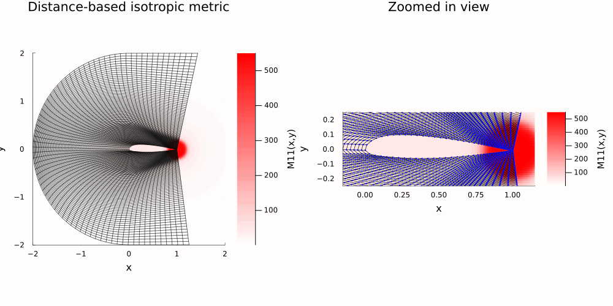
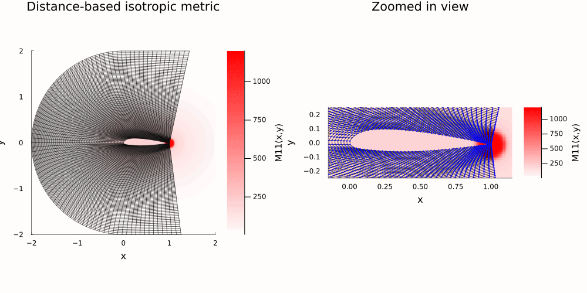

# Single Block with No Splitting
## 2D Single Block
Let's start by allowing the user to input a single [Tortuga](../GridFormat.md) block in the code. Thus the input will be the initial grid and the boundary information. The code will take in a 2D grid and solve the ODE along each edge of the domain. As the optimal number of points need not be the same for boundary edges across from each other, the code will proceed to resolve the edge that does not have the maximum number of points. Finally, the code will solve for the interior points using Transfinite Interpolation and update the boundary information with the new dimensions of the block. 

## Algorithm
To solve a single block, we pair the left edge with the right edge and the bottom edge with the top edge. For each pair:
- for each edge in the pair
  - Compute the 1D metric along the edge using `GridGeneration.Get1DMetric(edge, metricFunction)`
  - Project the edge to 1D (normalised arc length) using `GridGeneration.ProjectBoundary2Dto1D(edge)`
  - Solve the ODE for the point distribution using `GridGeneration.SolveODE(m, xs; solver)`
  - Compute the optimal number of points using `GridGeneration.ComputeOptimalNumberofPoints(sol, m)`
- set the optimal number of points for the pair to the max over its two edges
- for each edge
  - Re-solve the ODE with the pair's number of points using `GridGeneration.SolveODEFixedN(m, xs, N; solver)`
  - Project the 1D distribution back onto the edge using `GridGeneration.ProjectBoundary1Dto2D(edge, sol)`
- Run TFI on the four redistributed edges to get the final block using [`TFI`](@ref)

In the package this is `GetOptNEdgePair`, `ProcessEdgePairFixedN` and `SolveBlockFixedN`
(`src/blocksplitting/BlockFunctions.jl`), driven by [`SolveAllBlocks`](@ref), which also shares
the point counts between neighbouring blocks. Condensed:

```julia
function GetOptNEdgePair(edgeA, edgeB, M; solver=:analytic)
    optN = 0
    for edge in (edgeA, edgeB)
        xs = GridGeneration.ProjectBoundary2Dto1D(edge)
        m = GridGeneration.LinearInterpolate(xs, GridGeneration.Get1DMetric(edge, M))
        sol = GridGeneration.SolveODE(m, xs; solver=solver)
        optN = max(optN, GridGeneration.ComputeOptimalNumberofPoints(sol, m))
    end
    return optN
end

function ProcessEdgePairFixedN(edgeA, edgeB, M, N; solver=:analytic)
    map((edgeA, edgeB)) do edge
        xs = GridGeneration.ProjectBoundary2Dto1D(edge)
        m = GridGeneration.LinearInterpolate(xs, GridGeneration.Get1DMetric(edge, M))
        sol = GridGeneration.SolveODEFixedN(m, xs, N; solver=solver)
        GridGeneration.ProjectBoundary1Dto2D(edge, sol)
    end
end

function SolveBlockFixedN(block, M, (Ni, Nj); solver=:analytic)
    left, right = block[:, 1, :], block[:, end, :]
    bottom, top = block[:, :, 1], block[:, :, end]
    newLeft, newRight = ProcessEdgePairFixedN(left, right, M, Ni; solver=solver)
    newBottom, newTop = ProcessEdgePairFixedN(bottom, top, M, Nj; solver=solver)
    return TFI([newTop', newRight', newBottom', newLeft'])
end
```
## Custom Metric
Let's also create a tool to output a custom metric field. I make this function by computing the distance from the airfoil to the point with the following `w_rational(d, A, ℓ, p) = A / (1 + (d/ℓ)^p)` where $d$ is the distance, $A$ controls the amplitude, and $l$ and $p$ are used to control the fall off. This gives the space around the airfoil a higher metric value which decreases as you move away from the boundary. Let's also add a "hotspot" to control where the function places more points. We can achieve this by using the same function from above but rather than using the distance from the airfoil, we pass in the distance to the $(\text{hotspot}_x, \text{hotspot}_y)$. Finally we can add these two functions togethers.


### Examples 
Let's use a small grid around an airfoil as an example. Looping over hotspots along the airfoil domain we can make some fun gifs as shown below. We see that the basic TFI method struggles to preserve orthogonality in the interior points but I'm not worried about this. We can use higher order TFI methods or elliptic smoothing to remedy this.

#### Example 1

#### Example 2

#### Example 3
